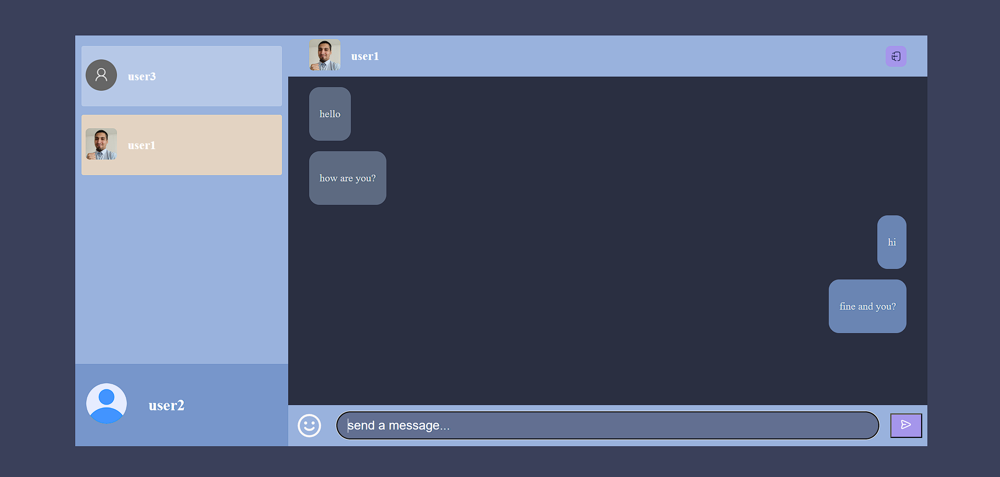

# Real-Time-Chat-Socket.io

Chat en tiempo real donde se utilizó el patrón de diseño Modelo,Vista,Controlador(mvc). Los usuarios pueden crear una cuenta e iniciar sesión, y todas las peticiones se hacen con la autorización por cabecera de JSON Web Token (JWT), una vez se inicia sesion te redirige a la página principal donde se mostrarán todos los usuarios que se hayan creado una cuenta, podrás iniciar un conversación con cada uno de manera individual.

## Vistas

### Login: página de inicio de sesión con email y contraseña creados, si no posees cuenta puedes seleccionar el link de crear cuenta que te redireccionara.

### Register: página de registro donde ingresas tus datos para crear una cuenta, la imagen de usuario es opcional

### Welcome page: página principal de chat una vez iniciada sesión.

## Tecnologías utilizadas

Este proyecto fue creado con el stack MySQL, Express, React y Node.js. En el FrontEnd, el proyecto fue creado con `npm create vite@latest` y las dependencias de producción incluyen :

- axios
- emoji-picker-react
- jwt-decode
- react, react-dom
- react-router-dom
- react-toastify
- socket.io-client
- styled-components

En el BackEnd las dependencias de desarrollo incluyen: 
- bcrypt
- connect-multiparty
- cookie-parser
- cors
- dotenv
- express
- jsonwebtoken
- mysql2
- socket.io
- zod

## Backend

El backEnd se realizó en node.js con express, se utilizó el patrón de diseño MVC, donde el código se dividió en Routers, Controllers y clases para el Modelo. En lo referente a la seguridad en la autentificación se implementó bcrypt para las contraseñas y para la autorización se creó un middleware que requiere de un token para tener acceso.

bcrypt: Al crear un usuario, la contraseña es encriptada con bcrypt y guardada en la base de datos esto para proteger los datos del usuario. Una vez inicias sesión se utiliza nuevamente la librería para decodificar la contraseña y autentificar al usuario. 

Zod: En el backend, las variables enviadas pasan por un validador (Zod) que se encarga de que las variables coincidan con el valor esperado y de indicar qué valores son requeridos y cuáles opcionales. Al crear un usuario hay un validador de coincidencia entre las contraseñas enviadas además en cuanto a la imagen para el usuario es opcional y si es enviada posee condiciones para ser guardada, debe tener un rango de extensión válida y no ser superior a un determinado tamaño.

Cors: Se agregó una configuración de cors a todas las rutas, permitiendo las peticiones HTTP-request POST,DELETE,UPDATE,GET. En esta configuración también se agregó los orígenes permitidos y se desactivo la opción de preflight.

Dotenv: Este proyecto utilizó variables de entorno para las constantes, esto a través de dotenv.

Connect-multiparty: Esta librería es necesaria para poder recibir a la imagen enviada desde el front, se agrega como middleware a la ruta de la petición.

Cookie-parser: Te permite trabajar con las cookies enviadas por petición.

Mysql2: Librería para conectar con una base de datos mysql, se trabajó con esta librería por que permite trabajar con promesas.

Jsonwebtoken: Se crearon dos archivos con jsonwebtoken, el primero es el accessToken el cual es devuelto en la respuesta de la petición cuando se autentifica el usuario(inicio de sesión) y la otra es el refreshToken que es utilizada cuando expira el accessToken del usuario permitiendo obtener otro, este refreshToken es enviado y recibido en las cookies, además se le agrego la opcion de Http-Only, para que solo puede ser accedido por cookies y no a traves de codigo.

socket.io: Es una libreria de Web Socket, te permite enviar mensajes de manera inmediata hacia el front, está configurado de tal manera que cada vez que un usuario envía un mensaje y es guardado correctamente en la base de datos socket io repliega el mensaje hacia el receptor sin que este esté realizando la petición de actualizar los mensajes.

El código está formateado con una configuración de ESLint.

## Frontend 

En el frontend el proyecto está hecho con React utilizando vite, en cuanto a los estilos se utilizó styled-component.

react-router-dom: Para definir las rutas disponibles para el usuario cuales son públicas, cuáles son privadas a través de la variable auth guardada en el state, recibido al iniciar sesion y hay algunas rutas que solo están disponibles para ciertos usuarios que tienen determinado rol, si el usuario no está autorizado lo redirige a una página con el mensaje.

react-toastify: Mensajes que aparecerán si se cumplen ciertas condiciones, por ejemplo si al crear usuario las password y comfirmpassword no coinciden.

styled-components: Para agregar estilos a los componentes y poder reutilizarlo.

socket.io-client: socket.io-client establece una conexión persistente y de baja latencia utilizando la tecnología WebSocket para habilitar la transmisión instantánea de datos entre las partes involucradas.

jwt-decode: Para decodificar el token y poder acceder a los datos
emoji-picker-react: Para poder escoger un emoji y agregarlo al mensaje que será enviado.

axios: Para realizar las peticiones asíncronas e instancias de axios esto para poder utilizar interceptors, esto se utilizó para interceptar la respuesta si existe un error específico, en concreto el error de expiración del token, si esto ocurre se enviará una petición al backend en la cual se envía el refreshToken para obtener una nuevo accessToken, además también todas las peticiones que son creadas con esta instancia se les agregara a la cabecera el token de la autorización.

## Requisitos previos

Antes de instalar y utilizar este proyecto, asegúrate de tener instalado MySQL en tu equipo. También deberás crear la base de datos y las tablas necesarias para el proyecto. Puedes encontrar el código SQL para crear la base de datos y las tablas en el archivo `sql.sql` del directorio '/Server/src/sql.sql'. Además tener instalado los paquetes de Node.js, en este proyecto se utilizó la versión 20.9.0

## Instalación

Para instalar este proyecto en tu equipo local, sigue estos pasos:
1. Clona este repositorio en tu equipo local.
2. Navega hasta el directorio del proyecto y ejecuta `npm install` para instalar todas las dependencias, esto debe realizarse tanto en la carpeta de App y Server.
3. Crea un archivo `.env` en el directorio de la App y el Server del proyecto y agrega tus variables de entorno.
    - Las variables de entorno del Server son:
        - PORTAPI
        - USER
        - PASSWORD
        - HOST
        - PORT
        - DATABASE
        - ACCESS_TOKEN_SECRET
        - REFRESH_TOKEN_SECRET
    - La variable de entorno de la App es:
        - VITE_PORT
4. Crea una base de datos en MySQL donde se tenga usuarios y mensajes(esta configuración ya está en el archivo sql.sql), donde un mensaje solo puede tener un emisor y un receptor pero un usuario puede tener varios mensajes (relación n:1)
5. Ejecuta `npm run start` para iniciar el servidor(en la carpeta Server) y luego se procede a iniciar la aplicación con `npm run dev`.
    
## Uso 

Para utilizar este proyecto, sigue estos pasos:
1. Abre tu navegador web y navega hasta http://localhost:5173.
2. Crea una cuenta o inicia sesión con una cuenta existente.
3. Una vez que hayas iniciado sesión, podrás enviar mensajes a otros usuarios.

