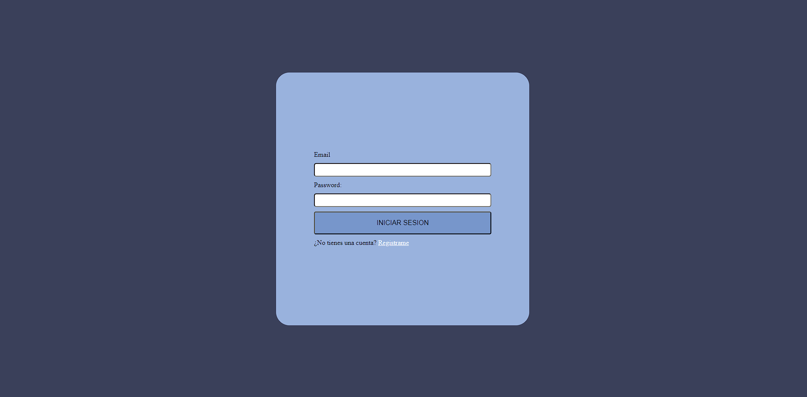
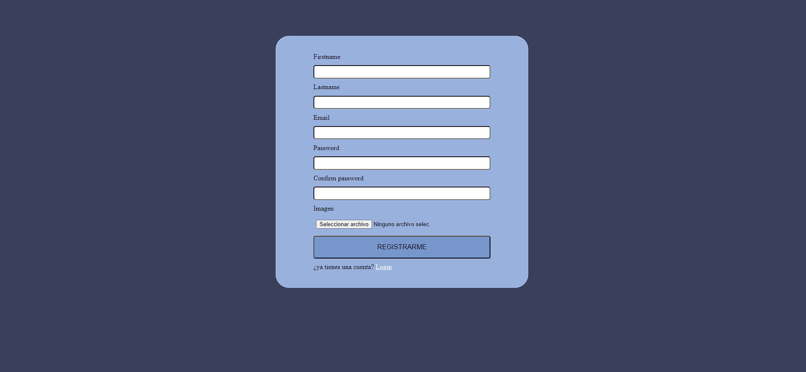
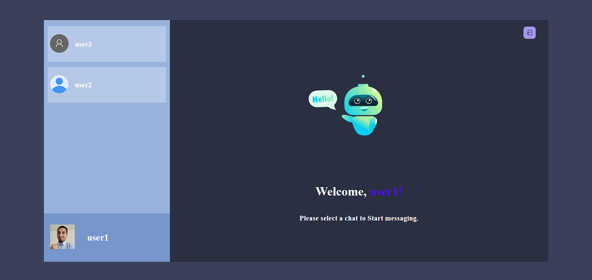

# Real-Time-Chat-Socket.io

Chat en tiempo real donde se utilizo el patron de diseño Modelo,Vista,Controlador(mvc). Los usuarios pueden crear una cuenta e iniciar sesión, y todas las peticiones se hacen con la autorización por cabecera de JSON Web Token (JWT), una vez se inicia sesion te redirige a la pagina principal donde se mostraran todos los usuarios que se allan creado una cuenta, podras iniciar un conversacion con cada uno de manera individual.

## Vistas

### Login: pagina de inicio de sesión con email y contraseña creados, si no posees cuenta puedes seleccionar el link de crear cuenta que te redireccionara.

### Register: pagina de registro donde ingresas tus datos para crear una cuenta, la imagen de usuario es opcional

### Welcome page: pagina principal de chat una vez iniciada sesión.

## Tecnologías utilizadas

Este proyecto fue creado con el stack MySQL, Express, React y Node.js. En el FrontEnd, el proyecto fue creado con `npm create vite@latest` y las dependencias de producción incluyen :

- axios
- emoji-picker-react
- jwt-decode
- react, react-dom
- react-router-dom
- react-toastify
- socket.io-client
- styled-components

En el BackEnd las dependecias de desarrollo incluyen: 
- bcrypt
- connect-multiparty
- cookie-parser
- cors
- dotenv
- express
- jsonwebtoken
- mysql2
- socket.io
- zod

## Backend

El backEnd se realizo en node.js con express, se utilizo el patron de diseño MVC, donde el codigo se dividio en Routers, Controllers y clases para el Modelo. En lo referente a la seguridad en la autentificacion se implemento bcrypt para las contraseñas y para la autizacion se creo un middleware que requiere de un token para tener acceso.

bcrypt: Al crear un usuario, la contraseña es encriptada con bcrypt y guardada en la base de datos esto para proteger los datos del usuario. Una vez inicias sesión se utiliza neuvamente la libreir apara decodificar la contraseña y atentificar al usuario. 

Zod: En el backend, las variables enviadas pasan por un validador (Zod) que se encarga de que las variables coincidan con el valor esperado y de indicar qué valores son requeridos y cuáles opcionales. Al crear un usuario hay un validador de coincidencia entre las contraseñas enviadas ademas en cuanto a la imagen para el usuario es opcional y si es enviada posee codiciones para ser guardada, debe tner un rango de extensio valida y no ser superior a un determinado tamaño.

Cors: Se agrego una configuracion de cors a todas las rutas, permitiendo las peticiones HTTP-request POST,DELETE,UPDATE,GET. En esta configuracion tambien se agrego los orogenes permitidos y se desactivo la opcion de preflight.

Dotenv: Este proyecto utilizo variables de entorno para las constantes, esto s tarves de dotenv.

Connect-multiparty: Esta libreria es necesaria para poder recibir a la imagen enviadada desde el front, se agrega como middleware a la ruta de la peticion.

Cookie-parser: Te permite trabajar con las cookies enviadas por peticion.

Mysql2: libreria para conectar con una base de datos mysql, se trabajo con esta libreria por que permite trabajar con promesas.

Jsonwebtoken: Se crearon dos archivos con jsonwebtoken, el primero es el accessToken el cual es devuelto en la respuesta de la peticion cuando se autentifica el usuario(inicio de sesión) y la otra es el refreshToken que es utilizada cuando expira el accessToken del usuario permitiendote obtener otro, este refreshToken es enviado y recicbido en las cookies, ademas se le agrego la opcion de Http-Only, para que solo puede ser accedido por cookies y no a traves de codigo.

socket.io: Es una libreria de Web Socket, te permite enviar mesajes de manera inmediata hacia el front, esta configurado de tal manera que cada vez que un usuario envia un mensaje y es guardado correctamente en la base de datos socket io repliega el mensaje hacia el receptor sin que este este realizando la peticion de actualizar los mensajes.

El código está formateado con una configuración de ESLint.

## Frontend 

En el frontend el proyecto está hecho con React utilizando vite, en cuanto al estilado se utilizo styled-component.

react-router-dom: Para definir las rutas disponibles para el usuario cuales son publicas, cuales son privatas a traves de la variable auth guardada en el state, recivido al iniciar sesion y hay algunas rutas que solo estan disponibles para ciertos usuarios que tienen determinado role, si el usuario no esta autorizado lo redirige a una pagina con el mensage.
react-toastify: 
styled-components:
socket.io-client:
jwt-decode:
emoji-picker-react:
axios:

## Requisitos previos

Antes de instalar y utilizar este proyecto, asegúrate de tener instalado PostgreSQL en tu equipo. También deberás crear la base de datos y las tablas necesarias para el proyecto. Puedes encontrar el código SQL para crear la base de datos y las tablas en el archivo `DB.js` del directorio raíz del proyecto.

## Instalacíon

Para instalar este proyecto en tu equipo local, sigue estos pasos:
1. Clona este repositorio en tu equipo local.
2. Navega hasta el directorio del proyecto y ejecuta `npm install` para instalar todas las dependencias, esto debe realizarse tanto en la carpeta de app y Api.
3. Crea un archivo `.env` en el directorio de la Api y app del proyecto y agrega tus variables de entorno.
    - Las variables de entorno de la Api son:
        - PORTAPI
        - user
        - password
        - host
        - port
        - database
        - Secret
    - La varible de entorno de la app es:
        - REACT_APP_URL
4. Crea una base de datos en POSGRES donde se tenga usuarios y notas(esta configuracion ya esta en el archivo DB.sql de la raiz del proyecto), donde una nota solo puede tener un usuario pero un usuario puede tener varias notas (relación n:1)
5. Ejecuta `npm run api` para iniciar el servidor y luego se procede a iniciar la aplicacion con `npm run app`.
    
## Uso 

Para utilizar este proyecto, sigue estos pasos:
1. Abre tu navegador web y navega hasta http://localhost:3000.
2. Crea una cuenta o inicia sesión con una cuenta existente.
3. Una vez que hayas iniciado sesión, podrás crear, leer, actualizar y eliminar notas.
